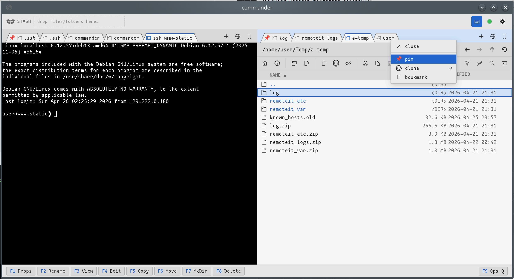

# install - quick try
```sh
# linux amd64 version (check version)
bash -c 'VERSION=2026.04.26; ARCH=x86_64; curl -L -o ~/commander-web "https://github.com/codemodify/commander-web/releases/download/${VERSION}/commander-web_linux-${ARCH}"'

bash -c 'VERSION=2026.04.26; ARCH=x86_64; curl -L -o ~/commanderd "https://github.com/codemodify/commanderd/releases/download/${VERSION}/commanderd_linux-${ARCH}"'

chmod +x ~/commanderd
chmod +x ~/commander-web

~/commanderd &
~/commander-web &
chromium --app=http://127.0.0.1:50001
firefox --no-remote -P default -new-window http://127.0.0.1:50001 --no-url
```

# install binary + systemd
- use this systemd [commander-web.service](./sysadmin/commander-web.service) and set the USER/GROUP

```sh
# linux amd64 version (check version)
sudo bash -c 'VERSION=2026.04.26; ARCH=x86_64; curl -L -o /usr/local/bin/commander-web "https://github.com/codemodify/commander-web/releases/download/${VERSION}/commander-web_linux-${ARCH}"'

sudo chmod +x /usr/local/bin/commander-web
sudo cp sysadmin/commander-web.service /etc/systemd/system/
sudo systemctl daemon-reload && sudo systemctl enable commander-web && sudo systemctl start commander-web
```

# what
- see https://github.com/codemodify/commanderd
- basically the Web Renderer for the `commanderd`
- run `commander-web` manually or from system service as above
- open with `chromium --app=http://127.0.0.1:50001` or similar

# screens
